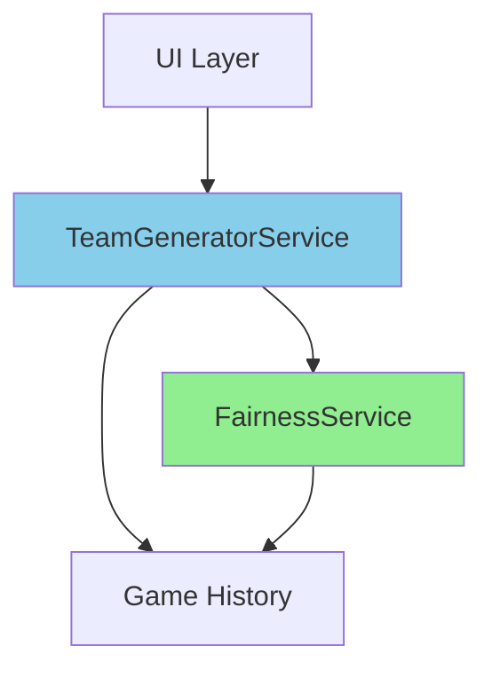

# Fair Balance Team Generation — Walkthrough

## Summary

Enhanced the team generation algorithm to promote long-term fairness by preferring partnerships with the lowest historical play counts while maintaining the existing daily non-repetition constraint.

## Changes Made

### New Files

#### [`fairness_service.dart`](file:///e:/App%20dev/My%20Apps/family_cards/lib/services/fairness_service.dart)

New service for evaluating team fairness based on historical partnership data:

- `buildPartnershipMatrix()` — Builds a partnership matrix from all historical games
- `scoreTeamConfiguration()` — Scores team configurations (lower = fairer)
- `getPartnershipCount()` — Gets historical partnership count between two players

### Modified Files

#### [`team_generator_service.dart`](file:///e:/App%20dev/My%20Apps/family_cards/lib/services/team_generator_service.dart)

- Added constructor requiring `FairnessService` and `List<Game>` dependencies
- Updated `_generateTeamsWithRetry()` to:
  - Build partnership matrix from all historical games
  - Generate 5 candidate team configurations
  - Score each candidate using fairness metrics
  - Select the candidate with the lowest score (fairest partnerships)
- Modified `_generateLeastUsedPairings()` to use global partnership matrix instead of daily `pairedWithToday` counts

#### [`providers.dart`](file:///e:/App%20dev/My%20Apps/family_cards/lib/providers/providers.dart)

- Added `fairnessServiceProvider`
- Updated `teamGeneratorServiceProvider` to inject `FairnessService` and games list

## Architecture

The implementation follows an extensible layered approach:



**FairnessService** (new) — Preference evaluation layer for extensibility
- Computes partnership matrix on-demand
- Scores team configurations
- Designed for future criteria additions

**TeamGeneratorService** (enhanced) — Core generation logic
- Generate-and-pick-best approach (5 candidates)
- Integrates fairness scoring
- Maintains hard constraint (daily non-repetition)

## How It Works

### 1. Partnership Matrix

Computed dynamically from all historical games:

```dart
// Example matrix structure:
{
  "player1_id": {
    "player2_id": 5,  // played together 5 times
    "player3_id": 2,
  },
  "player2_id": {
    "player1_id": 5,
    "player4_id": 0,
  }
}
```

### 2. Candidate Generation

When generating teams:

1. Try up to 50 random shuffles to find valid configurations (no daily repetition)
2. Upon finding first valid configuration, generate 4 more candidates
3. Score all 5 candidates using partnership matrix
4. Select candidate with lowest score (least-played-together partnerships)

### 3. Fallback

If no valid random configuration found within 50 attempts:
- Use deterministic `_generateLeastUsedPairings()` with global partnership matrix
- Greedily selects pairs with lowest historical counts

## Contracts Preserved

✅ **Daily Non-Repetition (Hard Rule)**
- No two players partner more than once per day
- Enforced BEFORE fairness evaluation
- Invalid pairs are filtered out completely

✅ **Long-Term Partnership Fairness (Soft Preference)**
- Partnerships converge to equal play counts over time
- Implemented via scoring and candidate selection

## Verification

### Compilation
✅ App builds successfully without errors

### Runtime
✅ App launches on Windows without issues

### Manual Testing Recommended

To verify fairness behavior:

1. Generate teams multiple times with the same player set
2. Observe that different partnerships are preferred
3. Add games to history and regenerate — should favor least-played-together pairs

## Technical Notes

- **No persistent storage** — Partnership matrix computed on-demand each time
- **Minimal changes** — Existing code preserved; functionality added via new service layer
- **Extensible design** — Future preference criteria can be added to `FairnessService`
- **Performance** — Matrix computation is O(n) where n = number of games; scoring is O(m) where m = number of teams
